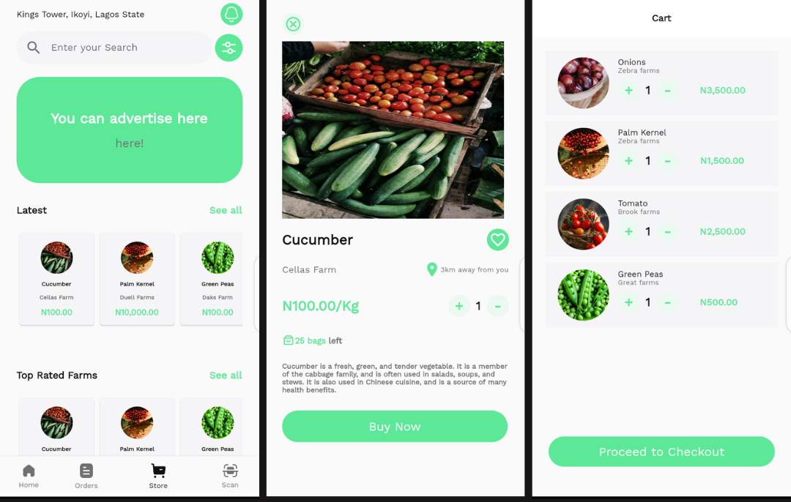

# App Information

AgroConnect is a mobile application that connects farmers to consumers as well as agricultural specialists. Farmers can post information about the produce they have for sale and consumers can simply find the nearest farmer to buy fresh agricultural produce, decreasing food waste.

A built-in AI model can also be used to diagnose plant illness and give treatment suggestions.

## SignUp Options for Consumer or Farmer.

## Market place for consumers.

## AI Plant disease diagnosis for farmers.
