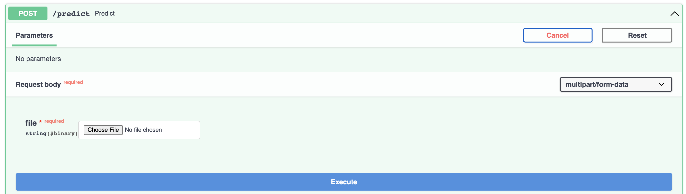

# Set up for disease prediction api.

_make sure you in this directory before running the commands_

## 1. Create and activate virtual env

$ `python3 -m venv [path to venv]`

$ `[path to venv]/Scripts/activate`

## 2. Install requirements

$ `pip install -r requirements.txt`

## 3. Run the fast api server using uvicorn

$ `uvicorn main:app --reload --host 0.0.0.0`

app is now running at http://localhost:8000/

## 4. Go to http://localhost:8000/docs to test endpoint.



Sample output.

```json
{
  "class": "Late Blight",
  "confidence": 0.583862841129303,
  "treatment": [
    "Plant resistant cultivars when available",
    "Remove volunteers from the garden prior to planting and space plants far enough apart to allow for plenty of air circulation.",
    "Water in the early morning hours, or use soaker hoses, to give plants time to dry out during the day — avoid overhead irrigation.",
    "Destroy all potato debris after harvest"
  ]
}
```

To test multiple sample images run `test.py` in `./test `

$ `python ./test/test.py`
